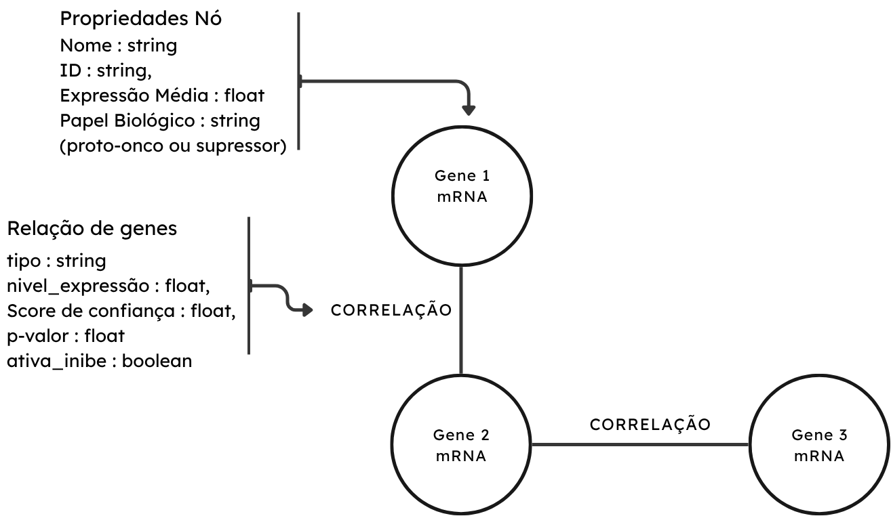
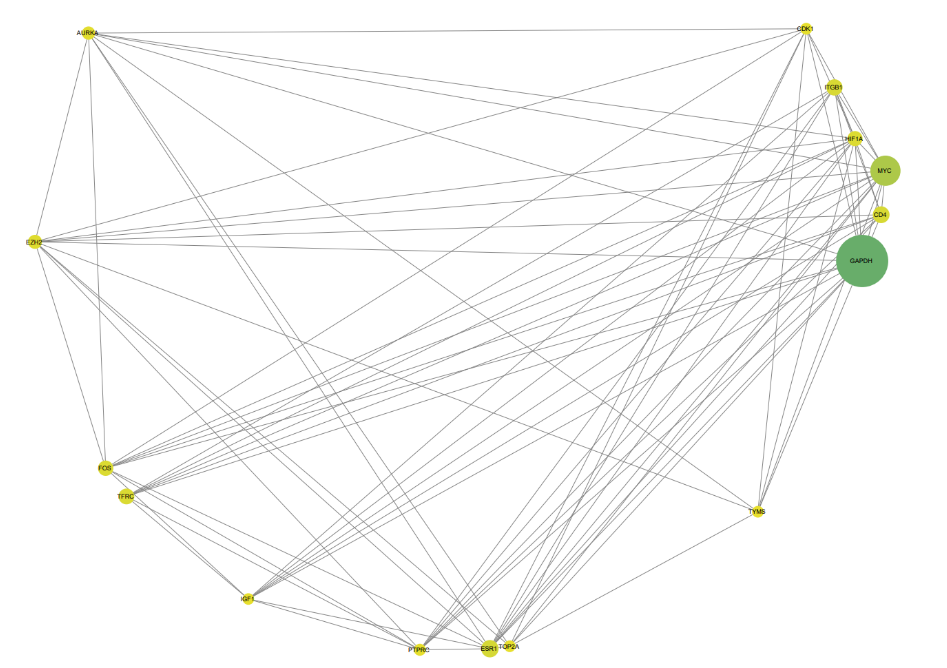
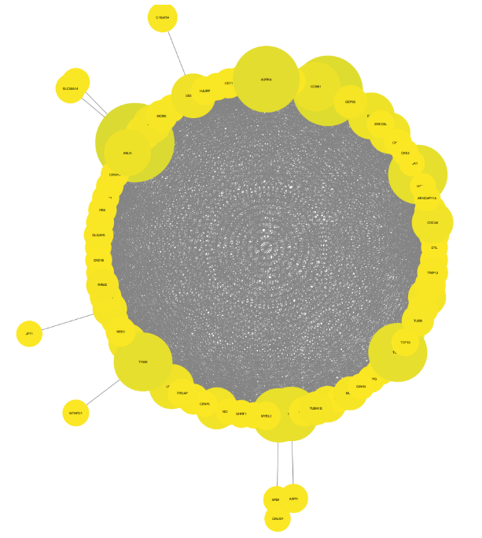
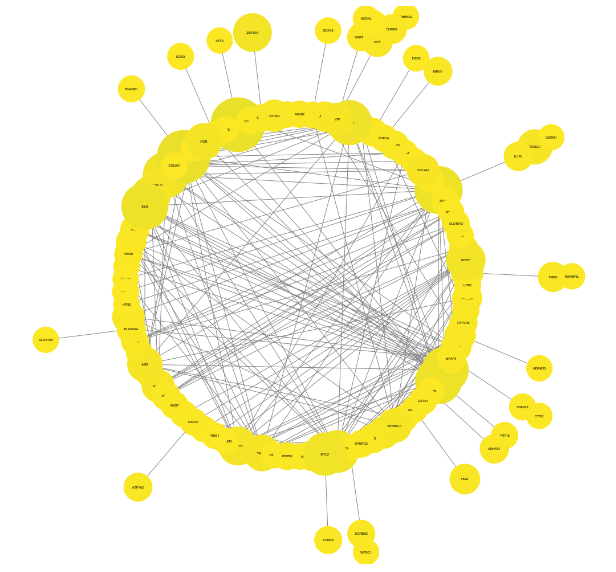

# Projeto `Assinatura de Progressão no Câncer de Próstata via Ciência de Redes`

# Project `Prostate Cancer Progression Signature via Network Science`

# Descrição Resumida do Projeto

O câncer de próstata (CdP) apresenta um comportamento biológico complexo, onde a transição de um estado indolente para uma forma maligna agressiva é acompanhada por mudanças drásticas no perfil de expressão gênica. O objetivo deste projeto é investigar a progressão da malignidade do CdP através da alteração na topologia das redes de interação de mRNAs. A estratégia central foca na combinação de múltiplos datasets transcriptômicos para mapear a evolução da doença em cinco estágios críticos, desde o tumor primário até o estado metastático insensível a andrógenos.

# Slides

> Coloque aqui o link para o PDF da apresentação da parte 2.

[Apresentação em pdf](./assets/slides/slides.pdf)

# Fundamentação Teórica

O projeto fundamenta-se na identificação de marcas funcionais do câncer e nos mecanismos moleculares de resistência que permitem a progressão da doença.

* **Artigos Base:**
    * **HANAHAN, Douglas (2026):** Fornece a base lógica das dimensões paramétricas e capacidades funcionais adquiridas que definem a doença durante a evolução adaptativa.
    * **ZHU, Y. et al. (2020):** Fundamenta a transição molecular para o estado de resistência à castração e a caracterização de modelos de progressão tumoral via variantes de receptor de andrógeno.

* **Problema:** Identificar como a rede de coexpressão gênica se reestrutura para conferir resistência a tratamentos hormonais e capacidade metastática, estabelecendo uma assinatura de progressão entre os diferentes estágios da doença.

# Perguntas de Pesquisa

1. Quais são os mRNAs centrais expressos em cada fase do tumor? 

2. É possível prever a progressão da malignidade do CdP? 

3. Existem grupos de genes que se mantêm estáveis ou desaparecem durante a progressão do câncer? 

4. É possível identificar um mecanismo de assinatura baseado na centralidade de nós para prever a progressão do CdP? 

5. Seria possível criar um mecanismo de identificação da possibilidade de aumento de malignidade do câncer com base em seu perfil de expressão?

# Metodologia

A análise aplicará estratégias de ***Ciência de Redes***. Pretendemos explorar a ***Análise de Centralidade*** para identificar "genes-hub" (reguladores centrais) e a comparação topológica entre as redes de cada fase da doença para detectar padrões de reorganização estrutural associados à malignidade.

% > Proposta de metodologia incluindo especificação de quais de Ciência de Redes que estão sendo usadas no projeto,
% > tais como: detecção de comunidades, análise de centralidade, predição de links, ou a combinação de uma ou mais técnicas. Descreva o que perguntas pretende endereçar com a técnica escolhida.

## Bases de Dados e Evolução

| Base de Dados | Endereço na Web | Resumo descritivo |
| :--- | :--- | :--- |
| **GSE148544** | [Link GEO](https://www.ncbi.nlm.nih.gov/geo/query/acc.cgi?acc=GSE148544) | RNA-seq de linhagens celulares (como Du145) e tecidos normais para identificar expressão diferencial regulada pela via HIF-1α. |
| **GSE149433** | [Link GEO](https://www.ncbi.nlm.nih.gov/geo/query/acc.cgi?acc=GSE149433) | Estudo em modelos PDX sobre o papel da variante AR-v7 na resistência a inibidores de sinalização de andrógenos (Abiraterona/Enzalutamida). |
| **GSE195659** | [Link GEO](https://www.ncbi.nlm.nih.gov/geo/query/acc.cgi?acc=GSE195659) | Perfil de expressão em linhagens LNCaP para investigar o PRMT1 como regulador da sinalização do receptor de andrógeno. |
| **GSE131985** | [Link GEO](https://www.ncbi.nlm.nih.gov/geo/query/acc.cgi?acc=GSE131985) | Transcriptomas de linhagens LNCaP95 com nocaute do receptor de andrógeno em condições de enriquecimento ou depleção hormonal. |
| **GSE210205** | [Link GEO](https://www.ncbi.nlm.nih.gov/geo/query/acc.cgi?acc=GSE210205) | Comparação entre linhagem benigna (BPH-1) e cancerígenas (DU145/PC3) para construção de assinaturas de resposta inflamatória. |

> Boa parte dos datasets precisam de um tratamento especial, o que dificultou o uso direto do GEO Soft no Orange. Esse foi um dos principais motivos para a adoção do R no tratamento e padronização das análises, permitindo um maior controle sobre os dados de entrada, os filtros estatísticos e a geração das tabelas utilizadas nas etapas posteriores.

## Modelo Lógico

> 

## Integração entre Bases

A integração entre as bases apresentou desafios principalmente relacionados à heterogeneidade dos dados e à necessidade de padronização do fluxo de análise. 

Foi observado que, algumas das amostras já se encontrava em estágios mais avançados, com genes diferencialmente expressos previamente organizados, enquanto outras ainda exigiam tratamento, pois eram dados crus. Além disso, houve limitação no número de amostras disponíveis para algumas comparações, o que inviabilizou determinadas análises estatísticas diretas. Para resolver esse problema, optou-se por consolidar diferentes linhagens metastáticas em uma única condição, ou seja, comparando-as com a condição "sem câncer". 

Essa decisão teve como principal objetivo aumentar a análise estatística e permitir a aplicação adequada do DESeq2. A partir disso, tornou-se evidente a necessidade de um workflow padronizado, capaz de receber datasets em diferentes pontos de processamento e ainda assim produzir saídas equivalentes e comparáveis entre si.

## Análise Preliminar

A análise preliminar foi construída a partir da comparação entre uma condição sem câncer e uma condição metastática, formada pela reunião de diferentes linhagens metastáticas em uma única classe.

Como resultado inicial, foram identificados aproximadamente 1.400 genes diferencialmente expressos. Para refinar esse conjunto e tornar a visualização viável, foram adotados filtros com p-valor de corte igual a 0.05 e log fold change maior que 2 ou menor que -2. Em seguida, foram geradas redes separadas para genes upregulated e downregulated, permitindo observar diferenças no padrão de conectividade entre esses grupos.

De forma preliminar, observou-se que os genes upregulated apresentaram maior conectividade entre si do que os genes downregulated. Entre os nós centrais da rede, destacaram-se genes associados à proliferação celular e entrada no ciclo celular, como CDK1, AURKA, ESR1 e IGF, além de complexos gênicos relacionados à biossíntese de DNA. Também foram observadas evidências de que muitos dos genes relevantes possuem atuação associada à porção nuclear da célula.

Por outro lado, não foram encontrados sinais expressivos relacionados à migração celular, possivelmente os dados analisados vieram de experimentos conduzidos in vitro, em condições que não foram feitas para induzir ou avaliar migração. Assim, a ausência desse sinal não interfere na natureza metastática das linhagens, mas ajuda a observar as limitações do contexto experimental empregado.

Rede completa:

> 

Subrede apenas com as de maior centralidade:

> 

Rede de Up-Regulated:

> 

Rede de Down-Regulated:

> 

## Evolução do Projeto

A evolução do projeto partiu da definição da abordagem que seria utilizada para analisar os diferentes estágios do câncer de próstata. Optou-se por trabalhar com amostras de pacientes distintos em diferentes fases da doença, o que trouxe desafios relacionados ao tratamento dos dados e à padronização de um único workflow de análise. Assim, o principal foco de desenvolvimento do projeto passou a ser a construção de uma pipeline reprodutível, capaz de receber tanto dados brutos quanto dados parcialmente processados.

# Ferramentas

- Linguagem: R (DESeq2, limma e ggplot2).
- Redes: String e DAVID.
- Visualização: Cytoscape para análise exploratória visual.

# Referências Bibliográficas

1. EVANS, T. S.; CHEN, B. Linking the network centrality measures closeness and degree. **Communications Physics**, v. 5, n. 172, 2022. DOI: [10.1038/s42005-022-00949-5](https://doi.org/10.1038/s42005-022-00949-5).

2. HANAHAN, Douglas. Hallmarks of cancer—Then and now, and beyond. **Cell**, v. 189, n. 3, p. S0092-8674(25)01498-9, 2026. DOI: [10.1016/j.cell.2025.12.049](https://doi.org/10.1016/j.cell.2025.12.049).

3. LUO, Y.; LIU, X.; LIN, J.; ZHONG, W.; CHEN, Q. Development and validation of novel inflammatory response-related gene signature to predict prostate cancer recurrence and response to immune checkpoint therapy. **Mathematical Biosciences and Engineering (MBE)**, v. 19, n. 11, p. 11345–11366, 2022. DOI: [10.3934/mbe.2022528](https://doi.org/10.3934/mbe.2022528).

4. National Center for Biotechnology Information (NCBI). **Gene Expression Omnibus (GEO)**. Disponível em: [https://www.ncbi.nlm.nih.gov/geo/](https://www.ncbi.nlm.nih.gov/geo/).

5. TANG, S. et al. A genome-scale CRISPR screen reveals PRMT1 as a critical regulator of androgen receptor signaling in prostate cancer. **Cell Reports**, v. 38, n. 8, 2022. DOI: [10.1016/j.celrep.2022.110417](https://doi.org/10.1016/j.celrep.2022.110417).

6. ZHANG, Y. et al. CDCA2 Inhibits Apoptosis and Promotes Cell Proliferation in Prostate Cancer and Is Directly Regulated by HIF-1α Pathway. **Frontiers in Oncology**, v. 10, p. 725, 2020. DOI: [10.3389/fonc.2020.00725](https://doi.org/10.3389/fonc.2020.00725).

7. ZHU, Y. et al. Role of androgen receptor splice variant-7 (AR-V7) in prostate cancer resistance to 2nd-generation androgen receptor signaling inhibitors. **Oncogene**, v. 39, p. 6935–6949, 2020. DOI: [10.1038/s41388-020-01479-6](https://doi.org/10.1038/s41388-020-01479-6).