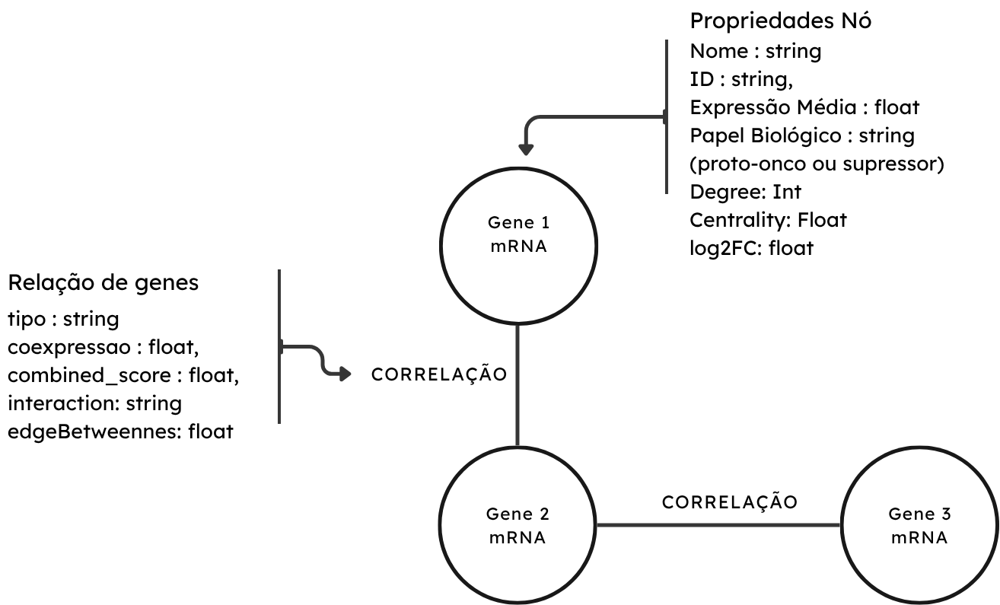
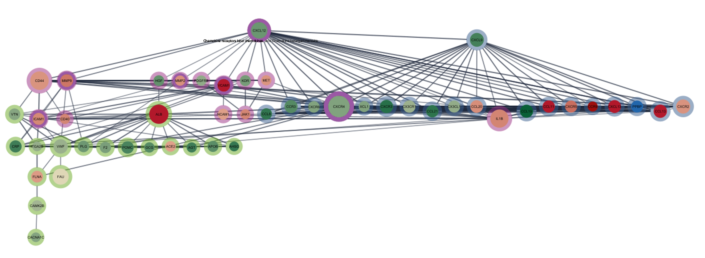
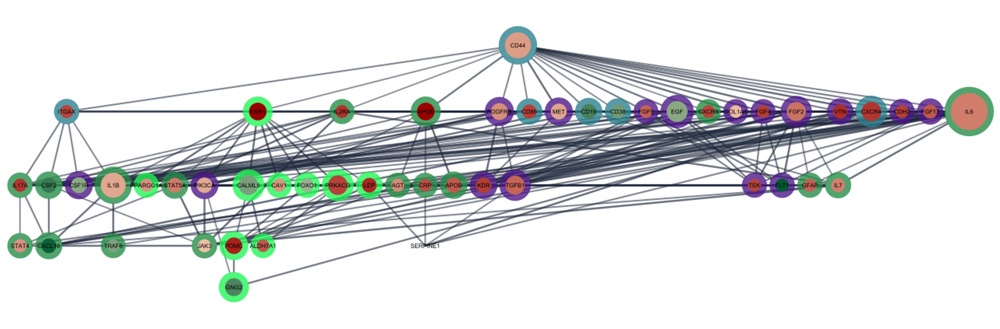
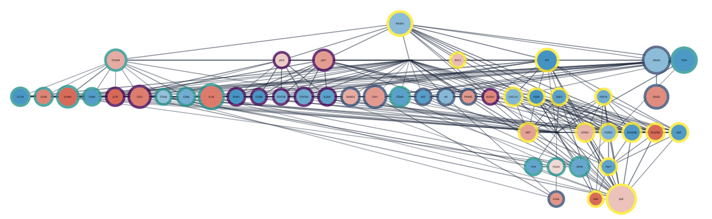
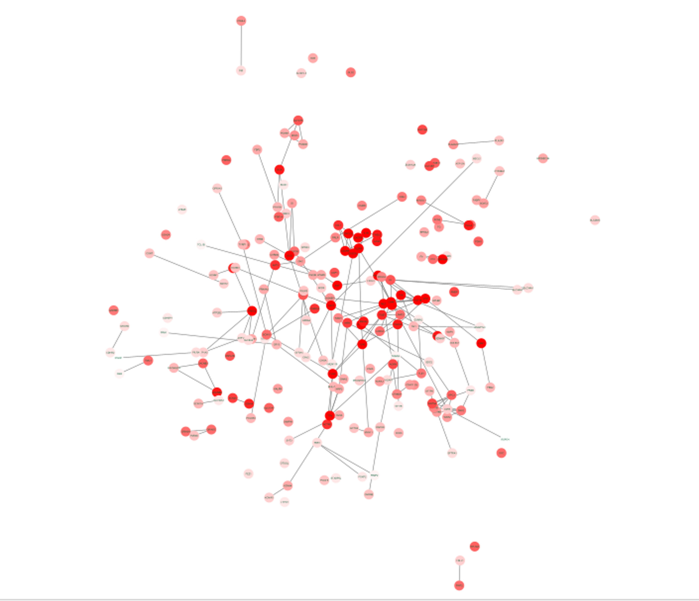
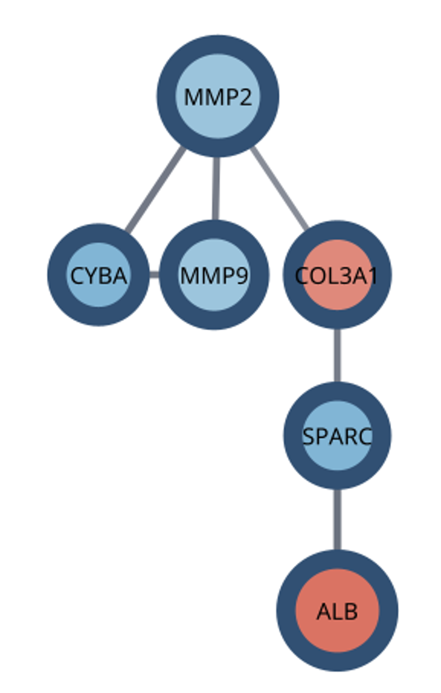
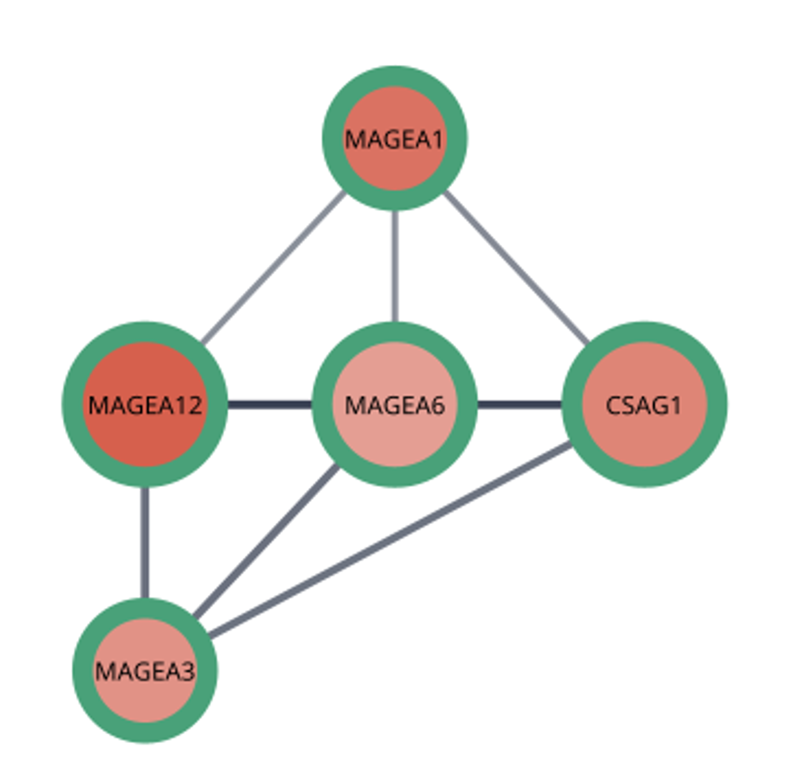
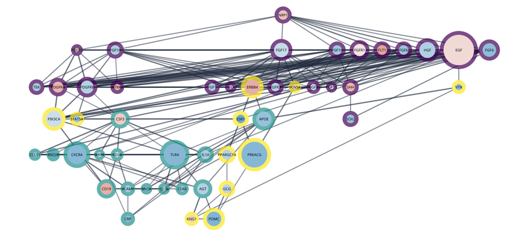
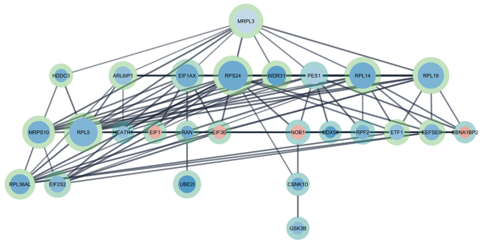

# Projeto `Assinatura de Progressão no Câncer de Próstata via Ciência de Redes`
# Project `Prostate Cancer Progression Signature via Network Science`

# Descrição Resumida do Projeto

O câncer de próstata (CdP) apresenta um comportamento biológico complexo, onde a transição de um estado indolente para uma forma maligna agressiva é acompanhada por mudanças drásticas no perfil de expressão gênica. O objetivo deste projeto é investigar a progressão da malignidade do CdP através da alteração na topologia das redes de interação de mRNAs. A estratégia central foca na combinação de múltiplos datasets transcriptômicos para mapear a evolução da doença em estágios críticos, desde o tumor primário até o estado metastático insensível a andrógenos. Para isso, os dados foram ubmetidos a análise diferencial de expressão utilizando bibliotecas do R, seguido por extração de redes através da base STRING, possibilitando a descoberta de genes hub entre cada transição de estágios.

# Slides

[Apresentação em pdf](./assets/slides/slides_apresentacao_final.pdf)

# Fundamentação Teórica

O projeto fundamenta-se na identificação de marcas funcionais do câncer e nos mecanismos moleculares de resistência que permitem a progressão da doença.

* **Artigos Base:**
    * **HANAHAN, Douglas (2026):** Fornece a base lógica das dimensões paramétricas e capacidades funcionais adquiridas que definem a doença durante a evolução adaptativa.
    * **ZHU, Y. et al. (2020):** Fundamenta a transição molecular para o estado de resistência à castração e a caracterização de modelos de progressão tumoral via variantes de receptor de andrógeno.

* **Problema:** Identificar como a rede de coexpressão gênica se reestrutura para conferir resistência a tratamentos hormonais e capacidade metastática, estabelecendo uma assinatura de progressão entre os diferentes estágios da doença.

# Perguntas de Pesquisa

1. Quais são os mRNAs centrais expressos em cada fase do tumor? 
2. Existem grupos de genes que se mantêm estáveis ou desaparecem durante a progressão do câncer? 
3. É possível prever a progressão da malignidade do CdP? 
4. Seria possível criar um mecanismo de identificação da possibilidade de aumento de malignidade do câncer com base em seu perfil de expressão?

Este projeto ajuda a responder a essas perguntas identificando clusters e hubs fundamentais de expressão diferenciada na transição do estado primário, até estados de metástase sensível ou não à andrógeno. 

# Metodologia

A abordagem proposta baseia-se na aplicação de Ciência de Redes voltada ao estudo de mecanismos moleculares do câncer. Utilizamos métricas de centralidade e extração de subredes para identificar genes-hub e padrões de *rewiring* (reestruturação) que sustentam a progressão tumoral. O fluxo de processamento (*pipeline*) foi estruturado em quatro eixos: 
1. **Compilação e Tratamento:** Padronização de dados brutos de múltiplos *datasets*.
2. **Análise Diferencial:** Identificação estatística de genes modulados entre 6 condições de comparação (ajuste Bonferroni com p-Value < 0.01 e |Log2FC| > 1.5).
3. **Modelagem de Redes:** Construção de grafos de interação proteica (STRING, *confidence* > 0.75) para análise de *hubs* e comunidades.
4. **Análise Topológica:** Cálculo de centralidade (*Degree, Betweenness, Closeness, Eigenvector*) para determinar o impacto estrutural da remoção de nós na dinâmica da rede.

## Bases de Dados e Evolução

| Base de Dados | Endereço na Web | Resumo descritivo |
| :--- | :--- | :--- |
| **GSE148544** | [Link GEO](https://www.ncbi.nlm.nih.gov/geo/query/acc.cgi?acc=GSE148544) | RNA-seq de linhagens celulares (como Du145) e tecidos normais para identificar expressão diferencial regulada pela via HIF-1α. |
| **GSE149433** | [Link GEO](https://www.ncbi.nlm.nih.gov/geo/query/acc.cgi?acc=GSE149433) | Estudo em modelos PDX sobre o papel da variante AR-v7 na resistência a inibidores de sinalização de andrógenos (Abiraterona/Enzalutamida). |
| **GSE195659** | [Link GEO](https://www.ncbi.nlm.nih.gov/geo/query/acc.cgi?acc=GSE195659) | Perfil de expressão em linhagens LNCaP para investigar o PRMT1 como regulador da sinalização do receptor de andrógeno. |
| **GSE131985** | [Link GEO](https://www.ncbi.nlm.nih.gov/geo/query/acc.cgi?acc=GSE131985) | Transcriptomas de linhagens LNCaP95 com nocaute do receptor de andrógeno em condições de enriquecimento ou depleção hormonal. |
| **GSE210205** | [Link GEO](https://www.ncbi.nlm.nih.gov/geo/query/acc.cgi?acc=GSE210205) | Comparação entre linhagem benigna (BPH-1) e cancerígenas (DU145/PC3) para construção de assinaturas de resposta inflamatória. |

**Análise das Bases:** Descobrimos que as bases continham dados granulares de *counts* de estudos independentes com estágios clínicos distintos. A principal transformação exigida foi a filtragem para selecionar apenas condições controle (sem veículo) e a conversão de *geneIDs* no *Orange*, garantindo padronização para a junção em uma tabela única.

## Modelo Lógico

O modelo lógico revisado define os nós como mRNAs (mapeados por cor de acordo com Log2FC e tamanho pelo *Score de Importância*) e as arestas como interações de coexpressão, cuja transparência é modulada pelo *String_Score*.

## Integração entre Bases

O principal desafio foi a heterogeneidade dos identificadores genéticos (*symbols* vs. *Entrez* vs. *Ensembl*). A integração foi realizada através de um *pipeline* visual no *Orange*, que permitiu o pareamento das colunas por linhagem celular e a normalização dos IDs, resultando em uma matriz final consolidada pronta para a modelagem estatística.

## Análises Realizadas

As análises foram divididas em **Análise de Escada** (BPH1 $\rightarrow$ 22Rv1 $\rightarrow$ LNCap $\rightarrow$ PC3) e **Análise de Grupos** (Câncer vs. Não Câncer, Metastático vs. Primário, Sensível vs. Insensível).  Para a extração dos diferenciais de expressão, utilizamos o pacote `DESeq2` no ambiente R, cujos resultados alimentaram posteriormente a modelagem de redes:

~~~R
dds <- DESeqDataSetFromMatrix(countData = countdata,
                              colData = coldata,
                              design = ~ condition_1)
dds <- DESeq(dds)
res <- results(dds)
~~~

Adicionalmente, computamos o *Score de Importância* dos hubs, normalizando métricas como *Betweenness Centrality* (para identificar pontes críticas) e *Eigenvector Centrality* (para influência indireta na rede).

## Evolução do Projeto

O projeto começou explorando arquivos suplementares já parcialmente processados (DEGs pré-computados pelas fontes). Contudo, a inconsistência estatística não permitia uma comparação inter-banco justa entre linhagens de estágios diferentes. Assim, reconstruímos o pipeline a partir dos dados brutos consolidados no Orange para junção tabular. Posteriormente, implementamos a análise matemática no pacote DESeq2 (R) para computar o p-value exato ajustado pelo método Bonferroni. Isso gerou uma consistência global na extração de subredes no Cytoscape, resultando numa mudança de rota crucial desde a primeira entrega.

# Ferramentas

* **NCBI GEO:** Fonte para extração dos dados brutos (*counts*) de transcriptômica.
* **Orange (Data Mining):** Utilizado no pré-processamento para filtragem, padronização e *merge* seguro do grande volume de tabelas brutas.
* **Linguagem R (DESeq2):** Ferramenta escolhida para a análise diferencial de expressão (cálculo rigoroso de *Log2FC* e *p-value* ajustado).
* **Cytoscape & STRING (stringApp):** Plataformas base para a modelagem visual das redes, importação de interações experimentais (*cutoff* de 0.75) e extração de métricas de centralidade.
* **DyNet:** Aplicativo de extensão do Cytoscape utilizado especificamente para a análise paramétrica de reestruturação topológica (*Rewiring*) ao longo das transições da doença.
* **KEGG / Reactome / Wiki Pathways:** Bases de dados de anotação utilizadas para o enriquecimento funcional, traduzindo os achados topológicos em vias biológicas reconhecidas.

## Resultados

Foram selecionados DEGs com Log2FC absoluto > 1.5 e p-adj < 0.01. A análise gerou os seguintes destaques:

### 1. Análise de Escada (Progressão Temporal)
* **BPH1 vs. 22Rv1:** 
  
  
  
  A transição inicial da progressão tumoral identificou os principais reguladores centrais com base na topologia da rede.

  **Top 10 Hubs (Score de Importância):** *CXCR4* (0.91), *ALB* (0.80), *CD44* (0.77), *IL1B* (0.76), *CXCL12* (0.69), *FAU* (0.66), *VWF* (0.59), *CXCR2* (0.58), *CXCL9* (0.57), *CCL13* (0.54)

  A análise de enriquecimento funcional revelou que esses componentes estruturais atuam fortemente em três vias biológicas críticas: **Sinalização de Quimiocinas** (envolvendo 20 genes, como *CXCR4*, *CXCL12* e *CXCR2*), **Reorganização da Matriz Extracelular - MEC** (composta por 17 genes, como *CD44*, *VWF* e *MMP9*) e vias de **Proliferação** (14 genes, incluindo *IL1B*, *HGF* e *MET*).

  **Destaques de Expressão Diferencial (DEGs):**
  * **Upregulated:** *VCAM1* (29.21), intimamente ligado ao comportamento agressivo e ao processo de Transição Epitélio-Mesênquima (EMT); *CCL11* (28.34) e *CCL13* (28.16), quimiocinas inflamatórias que atuam no recrutamento imune para evasão tumoral; *CXCL13* (22.35), com expressão regulada positivamente pelo eixo receptor de andrógenos, influenciando metástase e invasão; e *ALB* (16.82).
  * **Downregulated:** *PPBP* (-19.58), atuando como quimiocina para atração do sistema imune; *CCR9* (-15.64), que codifica o Receptor de Quimiocina 9; *CXCR5* (-8.81), participante da síntese de um receptor na superfície de células imunológicas; *MMP9* (-8.19), uma metaloproteinase de matriz que atua como "tesoura molecular" degradando e remodelando a MEC; e *IL1B* (-7.14), citocina pró-inflamatória Interleucina-1 beta (IL-1β).

* **22Rv1 vs. LNCap:** 
  
  
  
  A evolução para o estágio metastático (ainda sensível a andrógenos) demonstra uma rede onde a inflamação e a sinalização de crescimento tomam o controle central.  

  **Top 10 Hubs (Score de Importância):** *IL6* (1.00), *CD44* (0.70), *IL1B* (0.67), *EGF* (0.56), *PRKACG* (0.52), *CALML5* (0.52), *CXCR4* (0.52), *TGFB1* (0.51), *FGF2* (0.51), *GNG2* (0.47).

  A análise das interações revela um foco funcional maciço voltado para vias de **Proliferação** (envolvendo uma longa lista de reguladores, como os fatores de crescimento *FGF4, FGF2, EGF*, receptores como *PDGFRB, MET, KDR*, e a via da *PIK3CA*) e sinalização de **Quimiocinas** (representada por genes como *CXCL10, CXCR4, CXCR3* e *JAK3*), o que consolida a capacidade metastática e de suporte à sobrevivência celular.

  **Destaques de Expressão Diferencial (DEGs):**
  * **Upregulated (Expressão Positiva):** *FLT1* (11.58), um receptor de fatores de crescimento diretamente ligado à angiogênese; *CXCL10* (11.08), quimiocina inflamatória associada à facilitação da metástase; *CSF2* (8.85), que codifica a GM-CSF, favorecendo a metástase ao ativar as vias PI3K e Jak/STAT (proliferação/sobrevivência); além de *CD19* (8.02) e *GNG2* (7.71), este último atuando na supressão de PI3K.
  * **Downregulated (Expressão Negativa):** *ESR1* (-13.84), cuja supressão relaciona-se à reprogramação metabólica do tumor e ganho de resistência; *APOE* (-13.75), refletindo a redução da barreira imune em formas mais agressivas de tumor; *POMC* (-12.04); *LEP* (-11.65), gene da leptina; e *SERPINE1* (-11.50), classicamente associado à progressão da doença no microambiente.

* **LNCap vs. PC3:** 
  
  
  
  A transição para o estágio mais agressivo, caracterizado pela insensibilidade a andrógenos e alta capacidade metastática, revela uma rede dominada por sinalização inflamatória e reestruturação do microambiente tumoral.

  **Top 10 Hubs (Score de Importância):** *STAT3* (0.99), *CD44* (0.90), *EGF* (0.71), *GNAQ* (0.66), *TLR4* (0.61), *IL1B* (0.61), *PIK3R1* (0.60), *GNG2* (0.57), *KIT* (0.55), *CAV1* (0.54). 

  A biologia desta rede é amplamente governada por vias de **Citocinas** (envolvendo uma vasta lista de 26 reguladores, destacando-se *STAT3, IL1B, EGF, AR* e a família *JAK/STAT*), evidenciando uma modulação severa do sistema imune. Curiosamente, fatores clássicos associados à **Proliferação** (como *FGF4, FGF8* e *PIK3R1*) sofrem uma supressão (*downregulation*), sugerindo que a agressividade neste ponto independe das vias de crescimento tradicionais.

  **Destaques de Expressão Diferencial (DEGs):**
  * **Upregulated (Expressão Positiva):** *IL7R* (9.46), atuando na progressão tumoral e metástase; *PDGFRA* (9.31), receptor de tirosina quinase para sobrevivência celular; *ICAM1* (9.28), proteína de adesão intercelular clássica na transição para a resistência androgênica; além do complexo *SHH* (9.27) e *IL1B* (8.17), onde o *SHH* sinaliza para o estroma, alterando o microambiente para favorecer metástases.
  * **Downregulated (Expressão Negativa):** *FGF8* (-9.96) e *KIT* (-9.96), ambos conhecidos por estimular a proliferação; *IFNA1* (-9.79), proteína Interferon Alfa-1 que atua como supressor de tumor e modulador imune; *IL2RB* (-9.73), importante identificador para os linfócitos, relacionado à resposta imunológica antitumoral; e *IL17A* (-9.72), relacionado à progressão e sobrevivência tumoral.

* **Análise DyNet:** Genes com alto *rewiring* ao longo de toda a escada incluíram CD44, CXCR5, MET e PDGFRB, validando o remapeamento constante das vias de proliferação e remodelação da MEC na evolução do câncer.
   
   #### Análise DyNet (Rewiring da Rede de Referência Central)
   
   
   
   Para avaliar o comportamento global da rede, a ferramenta DyNet foi utilizada para medir o grau de reestruturação topológica ao longo de toda a progressão temporal contínua (BPH1 $\rightarrow$ 22Rv1 $\rightarrow$ LNCap $\rightarrow$ PC3).
   
   * **Alto *Rewiring* (Em vermelho intenso):** Representa os nós que sofrem mudanças drásticas em suas parcerias de interação a cada mudança de estágio, atuando como verdadeiros "motores" de adaptação da doença. A lista global destaca genes fundamentais como *CD44*, *MET*, *PDGFRB* e *CAV1*. O agrupamento funcional revelou que as maiores remodelações ocorrem em:
     * **Proliferação:** Altamente coordenada pela reestruturação das interações de *STAT3*, *AKT3*, *FGF4* e *FGFR3*.
     * **Remodelação da MEC:** Forte instabilidade e rearranjo em *ICAM1*, *ANXA2* e fatores estruturais como *COL12A1*.
     * **Quimiocinas e Citocinas:** Constante remapeamento imune liderado por reguladores como *JAK1*, *PIK3R1*, *CXCR6* e pela família *STAT* (*STAT5A*, *STAT5B*).
     
   * **Baixo *Rewiring* (Em vermelho desaturado):** Representa genes cuja "vizinhança" na rede se mantém praticamente intacta (como *TRIM54*, *FOXP2* e *CIB3*). Curiosamente, nas funções críticas de remodelação de matriz extracelular, apenas fatores extremamente pontuais (como *CYP46A1*, *F9*, *PRKAA2* e *KCNIP2*) mostraram baixa reestruturação, o que prova que a MEC como um todo é altamente mutável ao longo da malignidade.
     
### 2. Análise de Grupos

* **Câncer vs. Não Câncer (BPH1 vs. 22Rv2, LNCap e PC3)**

    

    
    &nbsp;&nbsp;&nbsp;
    
    

    A comparação entre a Hiperplasia Benigna (Não Câncer) e todos os estágios malignos revelou uma rede topologicamente dominada por mecanismos de reativação embrionária e alteração estrutural profunda.

    **Top 10 Hubs (Score de Importância):** *MAGEA12* (0.76), *CSAG1* (0.76), *MAGEA6* (0.76), *MUC5AC* (0.70), *XDH* (0.62), *GABRB3* (0.62), *IFI44* (0.60), *ZNF468* (0.59), *MAGEA3* (0.59), *MAGEA1* (0.59).

    A análise biológica dividiu a força dessa transição em dois grandes eixos:
    * **Antígenos Câncer-Testículo / Associados a Melanoma:** Destaque absoluto para a família *MAGEA* (*MAGEA1, MAGEA12, MAGEA6, MAGEA3*) e *CSAG1*. Estes são genes tipicamente restritos à linhagem germinativa masculina (testículos), mas que são reativados de forma aberrante pelas células neoplásicas para promover sobrevivência celular e mediar a evasão do sistema imunológico.
    * **Remodelação da Matriz Extracelular:** Forte mobilização de reguladores de síntese e degradação de colágeno, como *MMP2, MMP9, CYBA, COL3A1, SPARC* e *ALB*.

    **Destaques de Expressão Diferencial (DEGs):**
    * **Upregulated (Expressão Positiva):** *KLK4* (14.02), fortemente associado à capacidade de migração do câncer de próstata; *MAGEA1* (12.95), validando a reativação tumoral ectópica; *ALB* (12.89); e *GABRB3* (12.88), uma subunidade de receptor associada atipicamente a vias de crescimento e migração.
    * **Downregulated (Expressão Negativa):** Supressão de reguladores de migração como o *CXCR4* (-10.88); forte queda de *CXCR3* (-10.07), responsável pelo recrutamento de células de defesa para locais de inflamação; e inibição de *DKK3* (-10.51), um conhecido bloqueador da via Wnt, cuja supressão destrava o crescimento tumoral.

* **Metastático vs. Não Metastático (BPH1 e 22Rv1 vs LNCap e PC3)**

    

    Esta comparação foca na assinatura molecular que distingue as amostras tumorais metastáticas daquelas sem capacidade demonstrada de disseminação sistêmica.

    **Top 10 Hubs (Score de Importância):** *EGF* (0.83), *PRKACG* (0.75), *TLR4* (0.69), *CXCR4* (0.64), *PIK3CA* (0.59), *HGF* (0.59), *APOE* (0.57), *ERBB4* (0.57), *FGF17* (0.56), *POMC* (0.56).

    A análise topológica aponta que a rede é fortemente coordenada por componentes da **Via de Sinalização PI3K** (representada por uma vasta cascata como *PIK3CA*, *EGF*, *HGF*, *ERBB4*, *FGFR1*, *PDGFRA*, *PDGFRB* e *FLT1*), responsáveis direta ou indiretamente pela proliferação e sobrevivência da célula tumoral. Além disso, a rede recruta componentes envolvidos em rotas de **Quimiotaxia**, atuando de maneira ativa na resposta e no estímulo à migração celular.

    **Destaques de Expressão Diferencial (DEGs):**
    * **Upregulated (Expressão Positiva):** *CYP3A4* (9.88), enzima fundamental do sistema citocromo P450; *FLT1* (8.90), receptor de tirosina quinase para o fator de crescimento endotelial vascular (VEGF); *ERBB4* (7.98), receptor do fator de crescimento epidermal; *CD19* (7.80), marcador de células B; e *NTRK2* (7.47), associado à aquisição de resistência à quimioterapia e facilitação da metástase.
    * **Downregulated (Expressão Negativa):** Redução expressiva de *CXCL9* (-13.41), quimiocina responsável por atrair linfócitos T; *ESR1* (-12.44), receptor hormonal associado à proliferação e metástase; *IL17A* (-11.01), citocina que atua em sinais de sobrevivência e proliferação celular; e *PRKACG* (-10.43), que codifica a subunidade gama da proteína quinase A (PKA).

* **Sensível vs. Insensível a Andrógeno (Dependente x Independente de Andrógeno)**

    

    Esta análise contrasta o perfil topológico de linhagens celulares que ainda dependem do estímulo androgênico para progredir frente àquelas que adquiriram independência hormonal (resistência à castração).

    **Top 10 Hubs (Score de Importância):** *RPS5* (0.61), *RPS24* (0.56), *RPL5* (0.54), *WNT2B* (0.54), *RPL19* (0.49), *RPL14* (0.49), *GLYCTK* (0.49), *HSD3B1* (0.48), *LCE3D* (0.46), *MRPL3* (0.45).

    O achado mais marcante desta rede é a dominância absoluta de componentes voltados ao processamento de **RNA e Tradução** (como *RPS5*, *RPS24*, *RPL5*, *RPL19*, *RPL14*, *MRPL3*, *EIF3E*, *EIF2S2*, *ETF1*, entre outros). Isso demonstra que a transição para a independência androgênica altera profundamente as vias genéricas de funcionamento celular básico e a maquinaria de síntese proteica para sustentar a sobrevivência e a resistência do tumor.

    **Destaques de Expressão Diferencial (DEGs):**
    * **Upregulated (Expressão Positiva):** *RAB3A* (5.29), associado ao aumento na produção de ciclina e proliferação; *EBNA1BP2* (4.60), atuando diretamente na biogênese ribossomal; além de componentes chaves da maquinaria traducional como *EIF1* (4.21, fator de iniciação), *EIF3E* (3.94, fator de iniciação) e *NOB1* (3.78), uma proteína essencial associada à subunidade menor do ribossomo.
    * **Downregulated (Expressão Negativa):** Supressão de genes importantes de sinalização e microambiente, como *FZD8* (-9.60), ligado à comunicação celular; *TLR9* (-9.23), receptor comumente associado à alta malignidade; *UBE2I* (-9.19), que codifica uma enzima E2 de conjugação; *ENPP1* (-9.07), cuja modulação auxilia o câncer a evadir o sistema imune; e a helicase de RNA *DDX56* (-9.00).

# Discussão

A análise dos resultados permitiu confrontar diretamente as perguntas de pesquisa formuladas no início deste estudo, validando a eficácia da Ciência de Redes combinada à transcriptômica, mas também impondo limites realistas às abordagens puramente estruturais baseadas em *snapshots* estáticos.

### Relação com as Perguntas de Pesquisa
1. **Quais são os mRNAs centrais expressos em cada fase do tumor?**
   * *Respondida:* O pipeline identificou com precisão os principais *genes-hub* reguladores de cada estágio clínico. Observou-se uma transição clara de comando topológico: o início da malignidade é liderado por eixos inflamatórios e de invasão celular (*CXCR4* e *CD44*), evoluindo para sinalizações massivas de crescimento e metástase (*IL6* e *EGF*) e culminando na agressividade insensível a andrógenos controlada pelo hub *STAT3*.
2. **Existem grupos de genes que se mantêm estáveis ou desaparecem durante a progressão do câncer?**
   * *Respondida:* A análise pelo DyNet revelou que enquanto vias associadas à matriz extracelular (MEC), citocinas e quimiocinas sofrem um rearranjo drástico e contínuo (alto *rewiring*), componentes estruturais específicos da MEC e funções celulares básicas (como *CYP46A1* e *PRKAA2*) retêm forte estabilidade conectiva (baixo *rewiring*), preservando o esqueleto fundamental da rede.
3. **É possível prever a progressão da malignidade do CdP?** e 4. **Seria possível criar um mecanismo de identificação da possibilidade de aumento de malignidade com base no perfil de expressão?**
   * *Parcialmente Respondidas:* Embora tenha sido possível mapear e caracterizar a assinatura estrutural de agressividade biológica de cada estágio, a topologia obtida a partir de amostras independentes não se provou distinta ou linear o suficiente para funcionar como um modelo preditivo exato por si só. As redes explicam os mecanismos de transição, mas falham em atuar como rastreadores determinísticos de trajetórias temporais futuras sem o auxílio de modelos computacionais avançados.

### Avaliação dos Objetivos e Limitações do Modelo
O projeto foi bem-sucedido na **identificação de hubs específicos**, na **detecção de ganho/perda de interações (DyNet)**, no mapeamento das **alterações de centralidade** e nas **mudanças de modularidade** (como o redirecionamento para o metabolismo de RNA no estágio insensível a andrógenos). 

Contudo, o objetivo de construir uma **assinatura estrutural autônoma e preditiva da progressão tumoral** não foi plenamente satisfeito. Isso ocorreu porque o modelo trabalha com redes geradas a partir de recortes isolados de dados (*snapshots* transcriptômicos de linhagens distintas), introduzindo ruídos de fundo inerentes a datasets independentes. Para que um mecanismo de identificação de malignidade seja robusto, faz-se necessário migrar de métricas estatísticas clássicas de centralidade para abordagens de aprendizado profundo em grafos.

# Conclusão

O desenvolvimento deste projeto revelou-se um problema altamente desafiador, exigindo a harmonização de dados biológicos complexos e a aplicação rigorosa de conceitos de teoria dos grafos voltados à saúde.

* **Perspectiva Sistêmica:** A integração entre dados transcriptômicos e Ciência de Redes cumpriu seu papel principal de superar a análise isolada de expressão gênica. Em vez de apenas listar genes superestressados, o modelo contextualizou esses achados dentro de caminhos funcionais integrados (sinalização de quimiocinas, remodelação de MEC e tradução proteica), oferecendo uma compreensão abrangente e holística da progressão da doença.
* **Desafios Enfrentados:** O principal gargalo técnico centrou-se na etapa inicial de processamento e *data mining*. Unificar contagens brutas extraídas de diferentes plataformas do NCBI GEO exigiu um esforço complexo de tratamento de dados e mapeamento de domínios (*Gene IDs*) no fluxo do software Orange, antes que a análise diferencial pelo *DESeq2* e a modelagem no Cytoscape pudessem ser executadas com segurança.
* **Principais Lições Aprendidas:** A principal lição do grupo reside na compreensão de que a reestruturação das conexões de uma rede regulatória (*rewiring*) é um indicador biológico tão ou mais importante do que a simples abundância de um mRNA. Descobrir que a resistência androgênica se apoia na centralização de hubs ligados à maquinaria básica de tradução ribossomal exemplifica o poder que a visão de redes possui para desvendar estratégias adaptativas de evasão tumoral.

# Trabalhos Futuros

Para superar as limitações preditivas identificadas e refinar o isolamento de complexos macromoleculares, os desdobramentos futuros deste projeto devem focar em duas frentes complementares:

1. **Modelagem de Comunidades de Alta Resolução:** Avaliar e aplicar algoritmos robustos baseados em detecção de comunidades (como *Louvain* e *K-core decomposition*) em coconjunto com os scores de centralidade. Isso viabilizará a filtragem e a determinação de complexos proteicos exatos envolvidos no microambiente tumoral, reduzindo o tamanho das listas de genes alvo para validação experimental.

2. **Aprendizado Profundo com Redes Neurais em Grafos (GNNs):** Desenvolver um modelo preditivo baseado em arquiteturas de GNN utilizando o framework **PyTorch Geometric**. Diferente das métricas tradicionais, a GNN possui a capacidade de realizar o agregamento de mensagens (*message passing*), aprendendo representações matemáticas densas que levam em conta as características nativas do nó e a topologia estrutural de toda a sua vizinhança em múltiplas camadas (Layer-0, Layer-1, Layer-2).

3. **Classificação Automatizada de Estágios Clínicos:** O objetivo central da GNN será responder de forma exata à Pergunta de Pesquisa nº 4, criando um classificador capaz de receber uma rede de coexpressão arbitrária e rotulá-la corretamente sob a pergunta: *"A qual estágio de progressão tumoral este perfil de rede pertence?"*. Para viabilizar esse treinamento e mitigar o risco de *overfitting* (onde o modelo se especializa e decora apenas o comportamento biológico deste grupo específico de linhagens), será fundamental expandir massivamente a base de amostras de transcriptoma utilizadas na inicialização do grafo.

# Referências Bibliográficas

1. EVANS, T. S.; CHEN, B. Linking the network centrality measures closeness and degree. **Communications Physics**, v. 5, n. 172, 2022. DOI: [10.1038/s42005-022-00949-5](https://doi.org/10.1038/s42005-022-00949-5).

2. HANAHAN, Douglas. Hallmarks of cancer—Then and now, and beyond. **Cell**, v. 189, n. 3, p. S0092-8674(25)01498-9, 2026. DOI: [10.1016/j.cell.2025.12.049](https://doi.org/10.1016/j.cell.2025.12.049).

3. LUO, Y.; LIU, X.; LIN, J.; ZHONG, W.; CHEN, Q. Development and validation of novel inflammatory response-related gene signature to predict prostate cancer recurrence and response to immune checkpoint therapy. **Mathematical Biosciences and Engineering (MBE)**, v. 19, n. 11, p. 11345–11366, 2022. DOI: [10.3934/mbe.2022528](https://doi.org/10.3934/mbe.2022528).

4. National Center for Biotechnology Information (NCBI). **Gene Expression Omnibus (GEO)**. Disponível em: [https://www.ncbi.nlm.nih.gov/geo/](https://www.ncbi.nlm.nih.gov/geo/).

5. TANG, S. et al. A genome-scale CRISPR screen reveals PRMT1 as a critical regulator of androgen receptor signaling in prostate cancer. **Cell Reports**, v. 38, n. 8, 2022. DOI: [10.1016/j.celrep.2022.110417](https://doi.org/10.1016/j.celrep.2022.110417).
